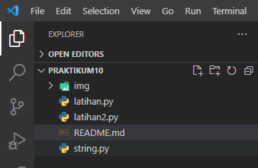
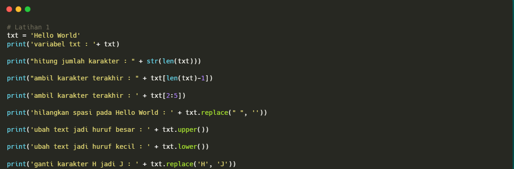
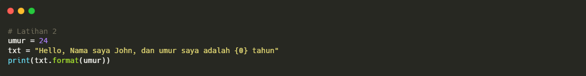
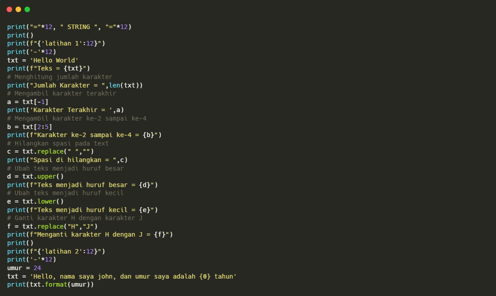
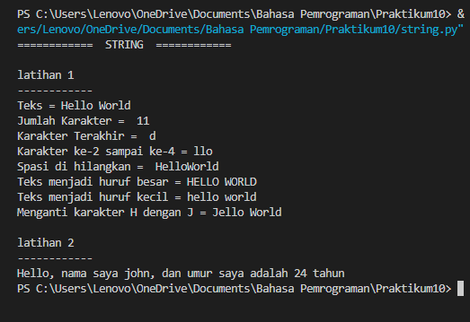

# praktikum10

~~~bash
Nama    :Muhammad Aldiansyah

Nim     :312210118

Kelas   :TI.22.B1
~~~

1. Pertama kita buat buat folder `Praktikum10` dan didalam kita buat file bernama `latihan.py` dan `latihan2.py`.

      

2. Lalu buka Latihan.py dan masukan coding sebagai berikut:

      

3. Selanjutnya buka Latihan2.py dan masukan coding sebagai berikut:

      

4. kemudian buka file `string.py` dan masukan codingan sebagai berikut lalu run dengan mengetikan perintah berikut diterminal `python string.py`:
      
      

      dan berikut hasilnya:
      
      

### Berikut untuk tugas Praktikum10, Terimakasih...